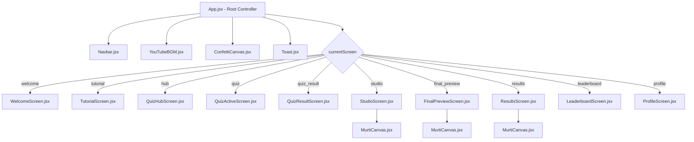

# 🛕 Ganesh Ji Eco Murti Maker — Comprehensive Technical Documentation & Game Guide

Welcome to the comprehensive technical documentation and complete gameplay guide for **Ganesh Ji Eco Murti Maker** — an interactive web application, educational simulation, and digital festival experience designed to celebrate Ganesh Utsav sustainably with traditional sacred clay and natural elements.

---

## 📋 Table of Contents

1. [Project Overview & Cultural Mission](#1-project-overview--cultural-mission)
2. [Technology Stack, Frameworks & Libraries](#2-technology-stack-frameworks--libraries)
3. [Architecture & Directory Structure](#3-architecture--directory-structure)
4. [Component Hierarchy & Responsibilities](#4-component-hierarchy--responsibilities)
5. [Core Subsystems Deep Dive](#5-core-subsystems-deep-dive)
   - [5.1 Murti SVG Rendering Engine (`MurtiCanvas.jsx`)](#51-murti-svg-rendering-engine-murticanvasjsx)
   - [5.2 Scoring & Environmental Engine (`scoring.js`)](#52-scoring--environmental-engine-scoringjs)
   - [5.3 Audio Engine & Web Audio Synthesizer (`audio.js`)](#53-audio-engine--web-audio-synthesizer-audiojs)
   - [5.4 YouTube Background Music System (`YouTubeBGM.jsx`)](#54-youtube-background-music-system-youtubebgmjsx)
   - [5.5 Particle Confetti System (`ConfettiCanvas.jsx`)](#55-particle-confetti-system-confetticanvasjsx)
   - [5.6 Local Storage & State Persistence (`storage.js`)](#56-local-storage--state-persistence-storagejs)
6. [Complete Tutorial: How to Play](#6-complete-tutorial-how-to-play)
   - [Phase 1: Player Onboarding & State Selection](#phase-1-player-onboarding--state-selection)
   - [Phase 2: Interactive Orientation](#phase-2-interactive-orientation)
   - [Phase 3: The 5-Tier Environmental Quiz Challenge](#phase-3-the-5-tier-environmental-quiz-challenge)
   - [Phase 4: Eco Murti Studio (Crafting & Customization)](#phase-4-eco-murti-studio-crafting--customization)
   - [Phase 5: Sacred Darshan Preview & Diya Ambience](#phase-5-sacred-darshan-preview--diya-ambience)
   - [Phase 6: Results & All-India Leaderboard with Rank Slider](#phase-6-results--all-india-leaderboard-with-rank-slider)
   - [Phase 7: Devotee Profile & Sacred Achievements](#phase-7-devotee-profile--sacred-achievements)
7. [Crafting Reference & Scoring Matrix](#7-crafting-reference--scoring-matrix)
8. [Installation, Setup & Deployment](#8-installation-setup--deployment)
9. [Troubleshooting & FAQs](#9-troubleshooting--faqs)

---

## 1. Project Overview & Cultural Mission

During Ganesh Chaturthi, millions of idols of Lord Ganesha are traditionally immersed into rivers, lakes, and oceans (Visarjan). When these idols are fabricated from non-biodegradable **Plaster of Paris (POP)** and coated with toxic chemical paints containing lead, cadmium, and mercury, severe environmental damage occurs to aquatic life, water tables, and ecosystems.

**Ganesh Ji Eco Murti Maker** was engineered to solve this ecological crisis through gamified education and interactive digital artistry:
* **Educational Quizzes**: Teaches players across all Indian states about biodegradable riverbed clay (*Shadu Mati*), plantable seed idols, natural mineral dyes (*Geru*, Turmeric, Beetroot), and organic cotton attire.
* **Progressive Crafting Studio**: Connects real knowledge directly to creative agency — clearing quiz levels unlocks higher-tier sacred traditional materials, forms, crowns, and backdrops.
* **Initial 0/100 Sacred Sculpting Phase**: Devotees begin with raw, unadorned sculpted clay, watching their eco and beauty scores grow authentically as they select sustainable embellishments.
* **National Competition**: Devotees submit their idols to the All-India Leaderboard, filterable by state and timeframe, equipped with interactive rank sliding controls.

---

## 2. Technology Stack, Frameworks & Libraries

The application is engineered intentionally with lightweight, high-performance web standards to ensure zero external UI runtime dependencies, high responsiveness, and fast mobile performance:

| Category | Technology | Version | Purpose / Functionality |
| :--- | :--- | :--- | :--- |
| **UI Framework** | [React](https://react.dev/) | `^19.2.8` | Declarative UI state management, component tree lifecycle, hooks (`useState`, `useEffect`, `useMemo`, `useCallback`, `useRef`). |
| **DOM Renderer** | [React DOM](https://react.dev/) | `^19.2.8` | Efficient virtual DOM diffing and DOM node mounting. |
| **Build Tool / Bundler** | [Vite](https://vite.dev/) | `^8.3.0` | Ultra-fast development server with Hot Module Replacement (HMR) and optimized rollup production bundles. |
| **Babel/SWC Plugin** | `@vitejs/plugin-react` | `^6.1.1` | Fast JSX transformation and React Fast Refresh support. |
| **Linter** | [Oxlint](https://oxc.rs/) | `^1.81.0` | Ultra-fast Rust-based static code analysis ensuring clean syntax and bug-free React code. |
| **Styling Engine** | **Vanilla CSS3** | Modern Standards | CSS Custom Properties (Variables), Flexbox, CSS Grid, Media Queries, Keyframe Animations, Glassmorphism backdrop-filters, custom scrollbar styling. |
| **Audio Engine** | **Web Audio API** | Native Browser API | Polyphonic synthesizer producing sacred temple bells, correct/wrong feedback chimes, and fanfare without external MP3 files. |
| **Background Music** | **YouTube IFrame API** | Web Standard | Seamless background devotional chant streaming with volume attenuation (30%), persistence, and safe mute toggling. |
| **Visual Effects** | **HTML5 Canvas API** | Native Browser API | 2D particle physics simulation generating colorful celebratory confetti on milestones and unlocks. |
| **Graphic Rendering** | **Scalable Vector Graphics (SVG)** | W3C Standard | Dynamic parametric vector murti rendering with radial gradients, drop shadow filters, and multi-layered SVG assets. |
| **Persistence** | **Web Storage API (localStorage)** | Native Browser API | Client-side persistent storage for player profiles, progress flags, level scores, unlocked achievements, and leaderboard rankings. |

---

## 3. Architecture & Directory Structure

```
ganesh-ji-eco-murti-maker/
├── index.html                      # HTML5 entrypoint with Google Fonts & metadata
├── package.json                    # Node dependencies, build scripts & metadata
├── vite.config.js                  # Vite configuration & React plugin registration
├── README.md                       # High-level repository overview & quickstart
├── DOCUMENTATION.md                # Comprehensive technical documentation (this file)
└── src/
    ├── main.jsx                    # React application root mounting
    ├── App.jsx                     # Master application controller, routing & global state
    ├── App.css                     # Root layout overrides
    ├── index.css                   # Global design tokens, animations, responsive CSS system
    ├── assets/                     # SVG icons & logo assets
    ├── data/                       # Static structured configuration & question banks
    │   ├── config.js               # Storage keys, states list, achievement definitions
    │   ├── craftData.js            # Materials, forms, colors, attire, crowns, decor data
    │   ├── initialLeaderboard.js   # Default all-India seeded leaderboard records
    │   └── questionBank.js         # Eco-quiz question bank categorized by level (1 to 5)
    ├── services/                   # Business logic, calculation & hardware interfaces
    │   ├── audio.js                # Web Audio API synthesizer for bells & sound effects
    │   ├── scoring.js              # Eco, beauty, bonus & celebration score algorithms
    │   └── storage.js              # LocalStorage CRUD manager with safe fallbacks
    └── components/                 # Reusable presentation & screen components
        ├── Navbar.jsx              # Global navigation bar with audio controls & player badge
        ├── YouTubeBGM.jsx          # Background devotional audio player with YouTube IFrame
        ├── ConfettiCanvas.jsx      # Celebration particle system
        ├── Toast.jsx               # Floating micro-interaction toast notifications
        ├── MurtiCanvas.jsx         # Parametric SVG Murti renderer (unadorned to master)
        └── screens/                # Main view state screens
            ├── WelcomeScreen.jsx       # Player registration & state selection
            ├── TutorialScreen.jsx      # Step-by-step interactive orientation
            ├── QuizHubScreen.jsx       # Level progression, lock status & studio launch
            ├── QuizActiveScreen.jsx    # Interactive question view with feedback
            ├── QuizResultScreen.jsx    # Score summary, pass/fail & unlock celebration
            ├── StudioScreen.jsx        # Crafting interface with live preview & tabs slider
            ├── FinalPreviewScreen.jsx  # Sacred darshan preview stage with diya lamps
            ├── ResultsScreen.jsx       # Final celebration certificate & summary
            ├── LeaderboardScreen.jsx   # All-India table with rank range slider & sticky headers
            └── ProfileScreen.jsx       # Player statistics, state ranking & achievements grid
```

---

## 4. Component Hierarchy & Responsibilities

The application implements a Single Page Architecture (SPA) orchestrated inside [`App.jsx`](file:///Users/mohammadarquam/Documents/ganesh-ji-eco-murti-maker/src/App.jsx):



### Screen Descriptions:
1. **`WelcomeScreen`**: Collects devotee's Name and Indian State/UT; manages profile switching.
2. **`TutorialScreen`**: A 4-step introductory walkthrough explaining eco-crafting rules.
3. **`QuizHubScreen`**: Visual roadmap showing quiz levels 1 to 5, cleared status, and studio access.
4. **`QuizActiveScreen`**: Displays randomized questions, answers, live score counters, and audio cues.
5. **`QuizResultScreen`**: Displays percentage score, pass/retry actions, and items unlocked.
6. **`StudioScreen`**: Split layout: left live murti preview with animated eco meter; right horizontal category tabs slider and responsive customization grid.
7. **`FinalPreviewScreen`**: Sacred darshan preview with glowing diya lamps, full score breakdown, and submission action.
8. **`ResultsScreen`**: Festive celebratory view displaying your final rank, badges, and sharing options.
9. **`LeaderboardScreen`**: Responsive national leaderboard with state/time filters, horizontal slide buttons, and an interactive **Rank Range Slider**.
10. **`ProfileScreen`**: Personal trophy room with achievement badges, statistics, and game history.

---

## 5. Core Subsystems Deep Dive

### 5.1 Murti SVG Rendering Engine (`MurtiCanvas.jsx`)
The Murti is rendered entirely using scalable vector graphics (`<svg>`) rather than pre-rendered raster images:
* **Initial Raw Sculpting Phase**: When layers (`color`, `clothing`, `crown`, `ornaments`, `decorations`, `mooshak`) are `null`, the idol renders in authentic unpainted earthen clay (`#a65637`) with natural clay shading folds, pure elephant face sculpt, and the sacred Janeu thread.
* **Skin Gradient Dynamic Mapping**: Colors chosen from `COLORS_DATA` dynamically update `<radialGradient id="claySkinGrad">`, tinting the idol in organic Turmeric Yellow, Beetroot Red, Geru Ochre, or Multani Mitti White.
* **Posture & Trunk Mechanics**: Posture settings dynamically recalculate the trunk Bezier path (`trunkPath`): Left-curved (*Vamamukhi*), Centered (*Riju*), or Right-curved (*Siddhivinayak*).
* **Layer Z-Index & Composition**:
  1. Background Mandap & Prabhavali
  2. Pedestal & Terracotta Lotus Base
  3. Four Divine Arms (holding Pasha lotus, Ankusha axe, Modak bowl, and Abhaya Mudra)
  4. Body, Seated Legs, Pot-Belly & Janeu Thread
  5. Elephant Ears & Ear Ornaments (Kundal)
  6. Elephant Face, Eyes, Chandan Tilak, Tusks & Trunk
  7. Traditional Malas & Ornaments (Gold, Pearl, Rudraksha)
  8. Sacred Mukut (Clay Mukut, Floral Crown, Master Golden Mukut)
  9. Devout Mooshak Ji with Modak or Bell
  10. Foreground Floral Rangoli & Terracotta Diyas

### 5.2 Scoring & Environmental Engine (`scoring.js`)
The `ScoringEngine` executes mathematical calculations balancing environmental purity and artistic aesthetics:

$$\text{Raw Eco} = \sum (\text{item.ecoPts})$$

$$\text{Eco Score} = \min\left(100, \max\left(0, \text{round}\left(\frac{\text{Raw Eco}}{135} \times 100\right)\right)\right)$$

$$\text{Beauty Score} = \min\left(100, \max\left(0, \text{round}\left(\frac{\text{Raw Beauty}}{185} \times 100\right)\right)\right)$$

$$\text{Eco Bonus} = \begin{cases} +10 & \text{if all key choices are chosen and completely eco-friendly} \\ 0 & \text{otherwise} \end{cases}$$

$$\text{Celebration Score} = \text{Quiz Score} + \text{Eco Score} + \text{Beauty Score} + \text{Eco Bonus}$$

* **Initial Phase Safeguard**: When no materials or items are selected yet, `ecoScore = 0`, `beautyScore = 0`, and the Eco Zone returns `🏺 Raw Clay (Initial Phase)`.
* **Penalty for POP**: Selecting Plaster of Paris grants only 5 eco points and disqualifies the player from the +10 Eco Bonus.

### 5.3 Audio Engine & Web Audio Synthesizer (`audio.js`)
To avoid loading heavy audio files and keep the synthesized sound effects independent of external audio files, `AudioManager` uses browser Web Audio synthesizers:
* **Temple Bell (`playBell`)**: Emits harmonic sine tones at 587.33 Hz, 880 Hz, 1174.66 Hz, and 1760 Hz with exponential gain decay mimicking bronze temple bells.
* **Success Fanfare (`playFanfare`)**: Synthesizes celebratory arpeggios (C5 $\rightarrow$ E5 $\rightarrow$ G5 $\rightarrow$ C6).
* **User Feedback Tones**: Sine oscillators for option clicks, gentle chimes for correct answers, and low buzzed triangles for incorrect answers or locked items.

### 5.4 YouTube Background Music System (`YouTubeBGM.jsx`)
Streams a devotional chant via an embedded hidden YouTube player:
* **30% Gentle Volume**: Automatically sets volume to 30% to provide serene ambiance without drowning out audio cues.
* **Session Continuity**: Remembers playing state and does not restart or stutter when navigating across screens.
* **Global Mute Sync**: Linked directly to the speaker icon in the Navbar.

### 5.5 Particle Confetti System (`ConfettiCanvas.jsx`)
Features a 2D physics loop that triggers bursts of 120 multicolored paper particles with gravity, rotational velocity, and air resistance upon quiz completion or murti submission.

### 5.6 Local Storage & State Persistence (`storage.js`)
Wraps `localStorage` with JSON serialization to safely store:
* `eco_murti_player`: Devotee name, state, and ID.
* `eco_murti_progress`: Highest unlocked quiz level, cleared stages, games played, personal best scores.
* `eco_murti_achievements`: Array of unlocked achievement IDs.
* `eco_murti_leaderboard`: National rankings array, pre-seeded with players across all Indian states.

---

## 6. Complete Tutorial: How to Play

### Phase 1: Player Onboarding & State Selection
1. When you launch the game, you arrive at the **Welcome Screen**.
2. Type your name into the **Devotee Name** input box.
3. Select your **Home State / Union Territory** from the dropdown menu (e.g., *Maharashtra, Gujarat, Karnataka, Delhi, Tamil Nadu*).
4. Click **🪔 Begin Sacred Journey**.

---

### Phase 2: Interactive Orientation
* The 4-step tutorial explains:
  1. **Ecological Crisis**: Why Plaster of Paris destroys aquatic life and rivers.
  2. **The Eco Quiz**: How answering environmental questions unlocks sacred materials and master crowns.
  3. **Studio Customization**: How to sculpt, color, and adorn Lord Ganesha while tracking your Eco Meter.
  4. **The All-India Leaderboard**: How to earn high scores and represent your state proudly.
* Click **Start Creating Now →** to enter the Quiz Hub.

---

### Phase 3: The 5-Tier Environmental Quiz Challenge
Customization options are locked behind 5 progressive quiz levels. You must score **at least 60% (3 out of 5 correct)** to pass a level and unlock items:

| Level | Level Title | Key Topics Covered | What It Unlocks |
| :---: | :--- | :--- | :--- |
| **1** | **Sacred Clay & Earth** | Traditional Shadu clay, plantable seed idols, Red soil, river pollution. | 🏺 Basic Clay Materials & 🎨 Natural Colors |
| **2** | **Divine Form & Postures** | Auspicious trunk directions (*Vamamukhi*, *Siddhivinayak*, *Riju*), sacred Mudras. | 🕉️ Form & Postures, 🐁 Mooshak Ji Mount |
| **3** | **Eco Colors & Attire** | Plant-based dyes (Turmeric, Beetroot, Geru, Indigo), Khadi & Organic cotton. | 🧵 Attire & Dhoti, 👑 Mukut, 📿 Malas |
| **4** | **Festive Decor & Mandap** | Biodegradable backdrops, Banana leaf arches, Marigold garlands, Terracotta diyas. | 🌸 Mandap, Backdrop & Festive Decor |
| **5** | **Immersion & Master Craft** | Home immersion rituals, organic fertilizer reuse, master idol sculpting. | ✨ Master Golden Mukut & Divine Prabhavali |

* **Taking a Quiz**: Select your answer from the 4 choices. Immediate visual and acoustic feedback will show whether you were correct, along with an educational explanation.
* **Unlocking Rewards**: Passing displays the celebration fanfare with confetti and marks the stage as cleared.

---

### Phase 4: Eco Murti Studio (Crafting & Customization)
1. Click **🎨 Open Eco Murti Studio** from the Quiz Hub or Navigation bar.
2. **Initial State (0 / 100)**:
   - Your idol begins in its **Initial Sculpting Phase**: pure unadorned sculpted riverbed clay sitting peacefully on the lotus throne.
   - The Eco Meter starts at **`0 / 100`** with the badge `🏺 Raw Clay (Initial Phase)`.
3. **Step-by-Step Customization**:
   - **🏺 Step 1: Material (Required)**: Choose between *Natural Shadu Clay*, *Plantable Seed Paper Pulp*, or *Natural Red Soil*. Avoid toxic POP! Selecting Shadu clay immediately raises your Eco Meter to 26/100.
   - **🕉️ Step 2: Form & Posture**: Choose your trunk posture (*Lalitasana Left*, *Padmasana Center*, or *Siddhivinayak Right*).
   - **🎨 Step 3: Natural Colors**: Coat Lord Ganesha with organic pigments like *Turmeric Yellow*, *Beetroot Red*, or *Geru Ochre*.
   - **🧵 Step 4: Attire & Dhoti**: Dress your murti in *Pitambari Silk*, *Crimson Red Dhoti*, or *Ivory White Khadi*.
   - **👑 Step 5: Crown (Mukut)**: Crown your idol with a *Traditional Shadu Mukut*, *Fresh Floral Mukut*, or the *Royal Golden Mukut*.
   - **📿 Step 6: Jewelry & Malas**: Adorn with *Rudraksha & Tulsi Mala* or *Triple-Strand Pearl Necklace*.
   - **🌸 Step 7: Mandap & Decor**: Frame your murti with a *Banana Leaf Mandap*, *Floral Petal Rangoli*, or *Divine Golden Prabhavali*.
   - **🐁 Step 8: Mooshak Ji**: Place Lord Ganesha's loyal mouse companion holding a modak or golden bell.
4. **Toggling Options**: If you want an unadorned look, clicking an already selected optional decoration card removes it.
5. **Eco Bonus**: If you decorate your idol entirely with organic, biodegradable choices, you receive a **+10 Eco Bonus**!

---

### Phase 5: Sacred Darshan Preview & Diya Ambience
* Click **✨ Realistic Preview →** to enter the grand darshan stage.
* View your handcrafted murti illuminated by warm flickering terracotta oil lamps (*diyas*).
* Review your **Quiz Score**, **Eco Score**, **Beauty Score**, and cumulative **Celebration Score**.
* Click **🎨 Edit Murti** to tweak adjustments or **🙏 Submit Murti →** to submit your creation to the nation.

---

### Phase 6: Results & All-India Leaderboard with Rank Slider
* Upon submission, your idol is logged into the national registry. If you beat your previous score, a **🎉 New Personal Best!** banner appears.
* Click **🏆 View National Leaderboard** to view rankings.
* **Using the New Leaderboard Slider**:
  - **🎚️ Rank Range Slider**: Drag the interactive slider thumb to smoothly glide through ranks from `#1` to `#N` in real time.
  - **Horizontal Slide Buttons (`❮` `❯`)**: Click the arrow buttons to slide table columns horizontally on mobile screens.
  - **Sticky Header**: Column headers stay pinned to the top as you scroll down through records.
  - **🎯 My Rank Button**: Click this badge to instantly slide the table directly to your highlighted entry!

---

### Phase 7: Devotee Profile & Sacred Achievements
Visit **My Profile** from the Navbar to view your festival achievements:

| Achievement Icon | Achievement Title | How to Unlock |
| :---: | :--- | :--- |
| 🌱 | **Earth Devotee** | Clear Level 1 Quiz (Sacred Clay & Earth). |
| 🌸 | **Floral Artisan** | Clear Level 4 Quiz (Mandap & Decor). |
| 🏆 | **Eco Master** | Score 90%+ on any quiz level. |
| 🎨 | **Sacred Sculptor** | Craft and complete your first Eco Murti. |
| 🌿 | **Green Guardian** | Achieve an Eco Score of 80 or higher. |
| 🌟 | **True Eco Champion** | Achieve an Eco Score of 90 or higher. |
| 👑 | **Master Creator** | Unlock Level 5 and crown your Murti with the Royal Golden Mukut. |
| 🚀 | **Rising Devotee** | Beat your personal best celebration score on a replay. |

---

## 7. Crafting Reference & Scoring Matrix

| Category | Option Name | Eco Points | Beauty Points | Eco Friendly? | Requirement |
| :--- | :--- | :---: | :---: | :---: | :---: |
| **Material** | Natural Shadu Clay | +35 | +30 | ✅ Yes | Level 1 |
| **Material** | Plantable Seed Paper Pulp | +40 | +28 | ✅ Yes | Level 1 |
| **Material** | Natural Red Soil | +35 | +27 | ✅ Yes | Level 1 |
| **Material** | Bamboo & Coconut Coir | +30 | +25 | ✅ Yes | Level 4 |
| **Material** | Plaster of Paris (POP) | +5 | +20 | ❌ No | Level 1 |
| **Color** | Turmeric Yellow | +20 | +18 | ✅ Yes | Level 1 |
| **Color** | Beetroot & Kumkum Red | +20 | +20 | ✅ Yes | Level 1 |
| **Color** | Spinach & Neem Green | +20 | +18 | ✅ Yes | Level 1 |
| **Color** | Natural Ochre (Geru) | +20 | +17 | ✅ Yes | Level 1 |
| **Color** | Multani Mitti White | +20 | +17 | ✅ Yes | Level 1 |
| **Color** | Synthetic Chemical Dye | +2 | +15 | ❌ No | Level 1 |
| **Attire** | Pitambari Silk Dhoti | +15 | +22 | ✅ Yes | Level 3 |
| **Attire** | Crimson Red Dhoti | +15 | +20 | ✅ Yes | Level 3 |
| **Attire** | Forest Green Dhoti | +16 | +19 | ✅ Yes | Level 3 |
| **Attire** | Ivory White Khadi | +20 | +21 | ✅ Yes | Level 3 |
| **Crown** | Traditional Shadu Mukut | +18 | +20 | ✅ Yes | Level 3 |
| **Crown** | Fresh Floral Eco-Mukut | +20 | +22 | ✅ Yes | Level 3 |
| **Crown** | Jeweled Festive Mukut | +15 | +24 | ✅ Yes | Level 3 |
| **Crown** | Royal Golden Mukut | +20 | +30 | ✅ Yes | Level 5 |
| **Malas** | Rudraksha & Tulsi Bead Mala | +15 | +18 | ✅ Yes | Level 3 |
| **Malas** | Golden Kanthihar & Armlets | +14 | +22 | ✅ Yes | Level 3 |
| **Malas** | Triple-Strand Pearl Necklace | +15 | +20 | ✅ Yes | Level 3 |
| **Decor** | Marigold Garland & Diyas | +20 | +20 | ✅ Yes | Level 4 |
| **Decor** | Banana Leaf & Bamboo Mandap| +25 | +22 | ✅ Yes | Level 4 |
| **Decor** | Floral Petal Rangoli & Durva| +24 | +23 | ✅ Yes | Level 4 |
| **Decor** | Divine Golden Prabhavali | +25 | +30 | ✅ Yes | Level 5 |
| **Mooshak** | Modak-Bearing Mooshak Ji | +10 | +15 | ✅ Yes | Level 2 |
| **Mooshak** | Golden Bell Mooshak Ji | +10 | +15 | ✅ Yes | Level 2 |

---

## 8. Installation, Setup & Deployment

### Prerequisites
* **Node.js**: Version 18.0 or newer
* **npm**: Version 9.0 or newer

### Local Development Setup
```bash
# 1. Clone repository or navigate to workspace
cd /path/to/ganesh-ji-eco-murti-maker

# 2. Install dependencies
npm install

# 3. Launch local Vite development server
npm run dev

# 4. Open in your browser
# Default: http://localhost:5173/
```

### Production Build
```bash
# Run the optimized Vite production build
npm run build

# Preview the production build locally
npm run preview
```

### Static Hosting Deployment
The output directory is `dist/`. You can deploy this static directory directly to any modern static hosting provider:
* **Vercel**: `vercel deploy`
* **Netlify**: Drag and drop `dist/` folder or link GitHub repo.
* **Firebase Hosting**: `firebase deploy --only hosting`
* **GitHub Pages**: Deploy contents of `dist/` branch.

---

## 9. Troubleshooting & FAQs

### Q1: Why does my murti start at 0/100?
> **Answer**: This is the intentional and authentic design! In traditional craftsmanship, an idol begins as raw, unbaked riverbed clay. You must pick your clay material and earn decorations to raise your score toward 100/100.

### Q2: Why is the background audio not playing automatically?
> **Answer**: Modern web browsers (Chrome, Safari, Firefox, Edge) block audio playback until the user interacts with the page (pointer down or key press). Simply click anywhere on the screen or toggle the 🔊 icon in the navigation bar to start the music.

### Q3: How do I change my player name or state?
> **Answer**: Click on your player badge in the top navigation bar or navigate to **My Profile**, and click **Change Player Details**.

### Q4: How do I remove a crown, jewelry, or decoration I selected?
> **Answer**: Click the selected option card again in the Studio pane. It will toggle off, and your Murti will update immediately.

---

*Ganpati Bappa Morya! May Lord Ganesha bestow wisdom, peace, and ecological harmony upon all devotees!* 🌺🙏🐘
